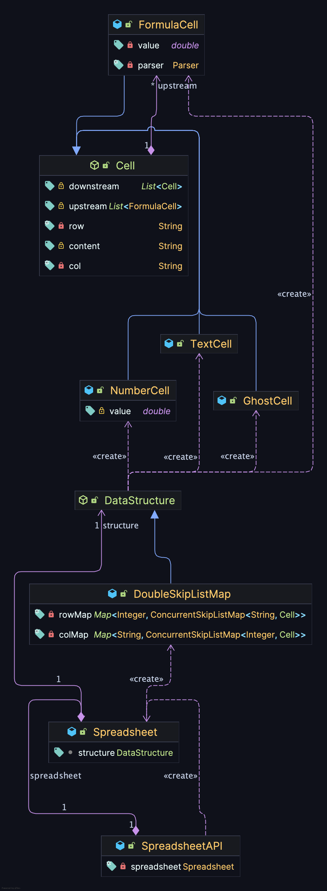
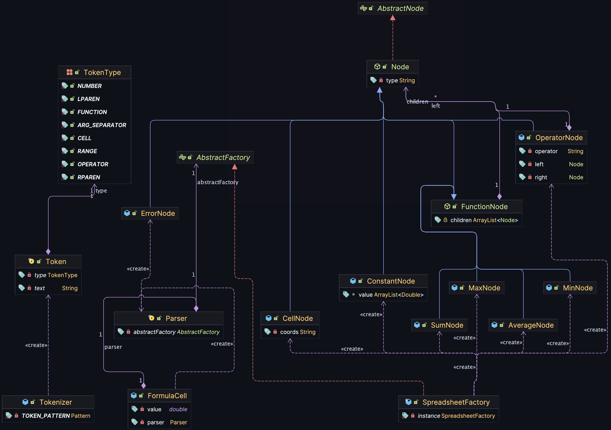
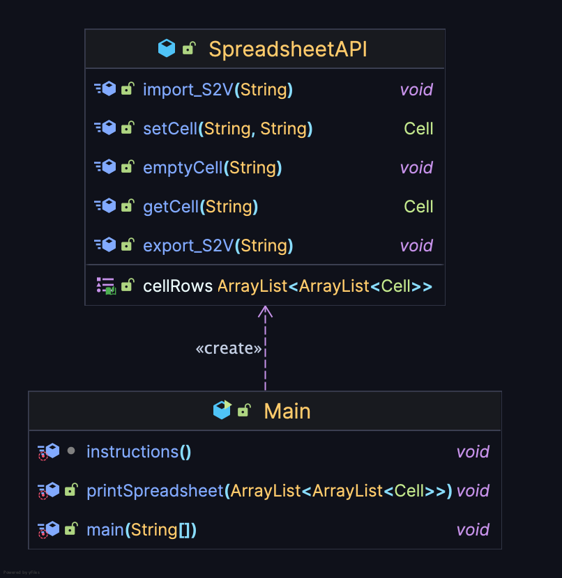

# Spreadsheet  

This is a project implemented for the Software Engineering class during CoDaS Master's course 1st year at UPC, 2025-2026. It is an implementation of a regular Spreadsheet with basic functionalities and formulas with automatic updates, as well as import and export functionalities.

The goal of this project is to get familar with correctly separating the functionalities of the classes, abstracting different parts of the project to allow for easy and accessible expansions/changes if something like that is needed/requested and, in general, follow the rules of [Clean Architecture](https://blog.cleancoder.com/uncle-bob/2012/08/13/the-clean-architecture.html).

## Use Cases

1) Import - Used to import a spreadsheet from a semicolon-sperated CSV file.
2) Export - Used to export a spreadsheet to a file with a similar format.
3) Get Value - Returns the value of a cell.
4) Set Value - Sets the value of a cell. It will not set the value if there are certain errors during initialization.
5) Delete Value - Deletes the value of a cell.
6) Print Spreadsheet - Outputs all the cells with initialized values (by the user), row-wise.
7) Exit.

Use Cases 4 and 5 will update all formulas they are contained in automatically.

## Design Choices

- A double [SkipList](https://docs.oracle.com/javase/8/docs/api/java/util/concurrent/ConcurrentSkipListMap.html) was used. Every cell is stored once, but it is referenced twice, in two different data structures, a map of SkipLists where every column is paired with a SkipList of its cells, and a map of SkipLists where every row is paired with a SkipList of its cells. To retrieve a cell, the structure checks if either the column or the row of the cell has more items and it queries the one with the least. SkipList is a data structure that has on average a complexity of O(log(n)) for insertion, deletion and search.
- The SkipLists are ordered alphabetically by default, but this has changed to follow the spreadsheet convention (A, B, ..., AA, AB, ...).
- The spreadsheet allows for the insertion of non-existent functions, but their value is NaN.
- If formulas have errors, most of the times they are allowed to exist, but they have a value of NaN.
- Formulas with circular references are not allowed to exist.
- All functions work correctly and all edge-cases that could be found have been accounted for.
- If a formula contains a cell with text or NaN content, the formula returns a NaN value as well.
- When a formula is inserted in the spreadsheet, all the whitespace is removed from it.

### Not Addressed Known Issues
- The spreadsheet cannot handle multiple operators in a row in formulas (functions with many inline +-).

## Classes

### Main Classes

In this diagram we can see the connection between the main classes of the project. 

The Cell has four children: Formula, Text, Number and Ghost. The first three cells hold the content that their names suggest. 

The fourth cell, Ghost, is a cell that is unseen by the user. It essentially is a placeholder that has references for empty/uninitialized cells that are used in formulas. This way, if a cell is created and should be contained in a formula, it gets the reference lists of the Ghost cell with the same coordinates and it updates the formulas that it is used in.

DataStructure is the class that abstracts the DataStructure of the spreadsheet. It can be swapped with different implementations, so long as it contains the main functions that have to be implemented: setCell, getCell, deleteCell, getSortedKeys (a function that returns a sorted reference list of rows) and getRange. createCell is implemented inside the DataStructure itself.

The Spreadsheet is the main class of the project. It is where everything meets to actually create the spreadsheet. The SpreadsheetAPI is an encapsulating class that abstracts Spreadsheet.

### Formula Classes

This diagram contains the rest of the classes that concern the handling of formulas. As it is shown, their connection to the rest of the project is through the FormulaCell class.

To begin with, TokenType is an ENUM class that contains all the possible token types that can occur. Token is a record class that contains the token itself. Tokenizer is the class that handles tokenization. Its input is the formula string and its output is a stream of tokens. This class is used in the Parser.

There are two interfaces that the Parser uses to create the expressions, AbstractNode and AbstractFactory. The first one is an abstraction of all the different types of nodes that can be used in the expressions and the second one is the [factory class](https://refactoring.guru/design-patterns/factory-method), it contains the (declaration of the) functions that build the nodes of the expression tree.

The previous classes are expanded upon by Node and SpreadsheetFactory. Node is in itself an abstract class that expands into several children: OperatoreNode, FunctionNode, ErrorNode, CellNode and ConstantNode.

The ConstantNode contains a number.

The CellNode contains either the ID of a cell (e.g. "A1") or a list of IDs of cells. This is because CellNodes are used to represent both Cells and Ranges (e.g. "A1:A10") in expressions. The ErrorNode is a node that only returns the value NaN and it is returned in the place of an expression when there is an error with the formula. Lastly, the OperatorNode represents and performs an operation (+-*/) on two other nodes.

The FunctionNode is an abstract class that has four children: SumNode, AverageNode, MaxNode, MinNode. These classes implement the respective function. They take as an input a list of Nodes (Cells/Ranges/Both). FunctionNode can be expanded upon with any class that the user may want to add. They only have to add the class file and a switch case in the SpreadsheeFactory in the “makeFunction” function.

All of the Node children are required to have a function called “getValue()”. This function returns a list of values that is used by the function cells when they have a list of multiple nodes as input. For the rest of the Nodes and the Node that the FormulaCell will receive, the list contains only one value in the first index.

Lastly, the Parser is the class that creates the expression. It implements the [shunting yard algorithm](https://en.wikipedia.org/wiki/Shunting_yard_algorithm) and it is the class that builds and checks for the validity of the former.

### Output/UI Classes

Last but not least, here we can see that the Main function is really only connected to the SpreadsheetAPI. We can also see the functions that represent the 6 Use Cases (cellRows is used by printSpreadsheet) are the only ones contained in the SpreadsheetAPI class. The SpreadsheetAPI class exists solely to be an abstraction of the Spreadsheet class and to allow further scaling if something like that is required (it allows for the easy implementation of multiple concurrent spreadsheets).

The Main class is responsible for all the UI output (except errors that may occur in some cases).

Because there is no way to synchronize the output of System.err and System.out in IntelliJ, something that many times caused their overlapping, System.err was redirected to System.out.

## Comments

- The project was implemented in a MACOS environment with IntelliJ IDEA.
- demo.csv contains a demo spreadsheet that uses many of the project's functions.